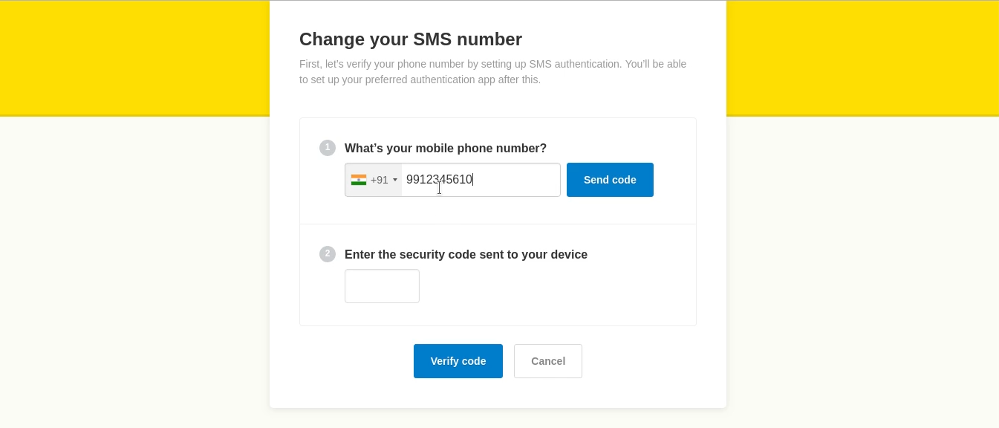
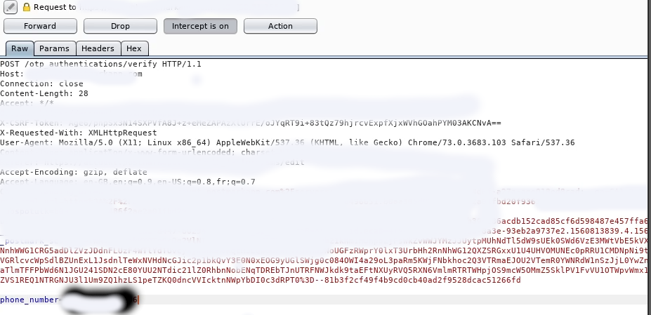
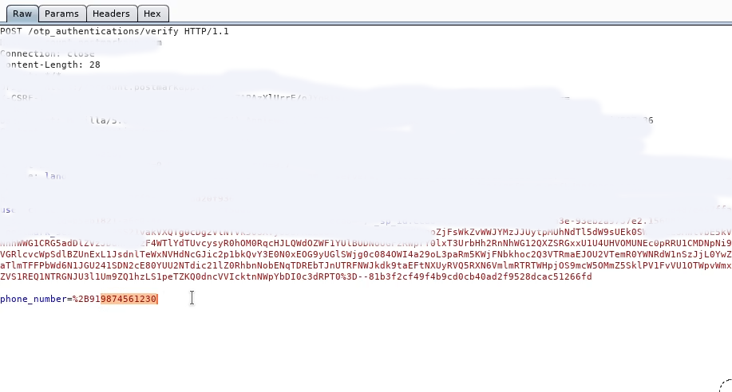
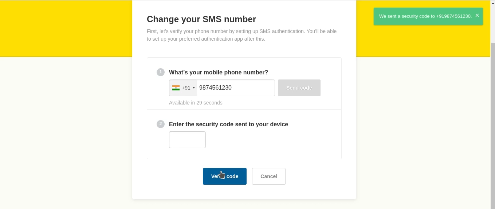
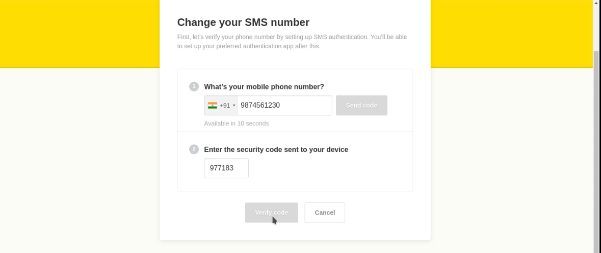

# OTP Manipulation:
 
Hey there learners , so recently i found i got a invitation for a private program on Bugcrowd so after spending 30 mins of recon i found that i was able to redirect the OTP from victim number to the attacker so instead of going into theory lets just jump in :D

So here i used:
my real number : *********6
fake number : 9876543210 
so first i i requested otp on 9876543210 

 Intercepted the request in Burpsuite and changed the number to *********6
 and forwarded the request

* initial request

* Modified request 

A pop showed that OTP was sent to +919876543210

A otp was received on my actual number *********6

 After i have entered the above OTP and clicked verify code

I was able to verify the number which didn't belong to me :D

# conclusion:

so what exactly i did here was the OTP which was supposed to be sent on 9876543210 , instead it was sent on my *********6 , due to lack of validation as it was only validating on the client side 

i hope you enjoyed it :D
