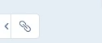
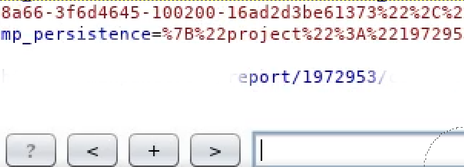
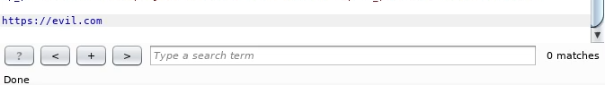
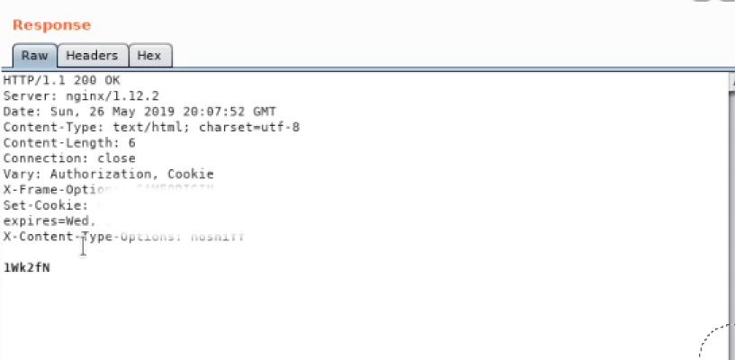
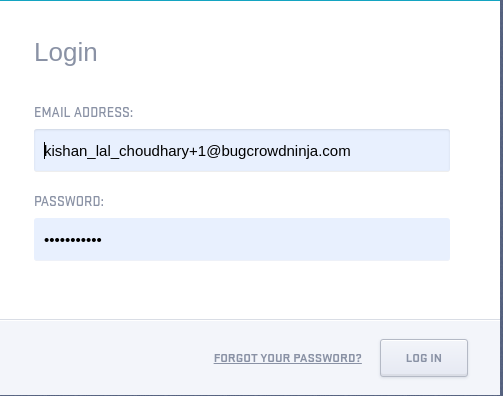
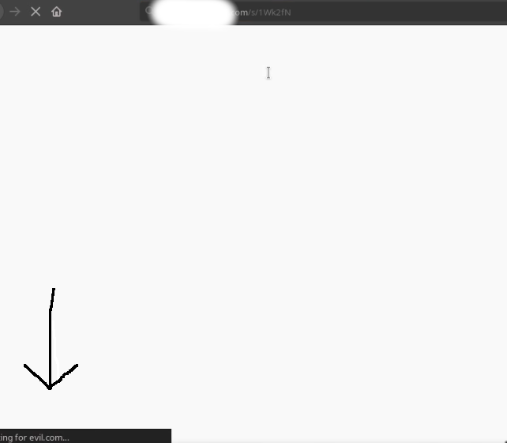
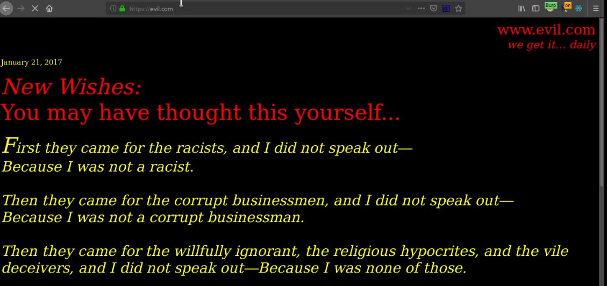

# A Crazy Open Redirect 

Hey there learners, today's lets look into something which we should always look into it, *"New Features"* yeah you heard it right many application have many new features and stuffs which try make users work more easy ,So here what i did was, I found a short link feature which lead to "Open redirect" once the user logins, so not gonna go much in theory lets just jump in :D.

First on the bottom left i found this tiny little option 

I clicked on it, it generated a short link for the report i quickly sent it to burpsuite for analyzing 

and checked the response i found a small hash like thing and after looking back at the actual short link ive notice that example.com/s/hash can redirect to other sites 

I quickly changed the url to https://evil.com in post request and got a another value 

 
So i combined it with https://example.com/s/*"evil hash from response"*

I opened it in other browser i was taken to the login page  :\

Once i logged in to my account BOOM!! I was redirected to evil.com

 * Bugcrowd VRT P4 - $150
