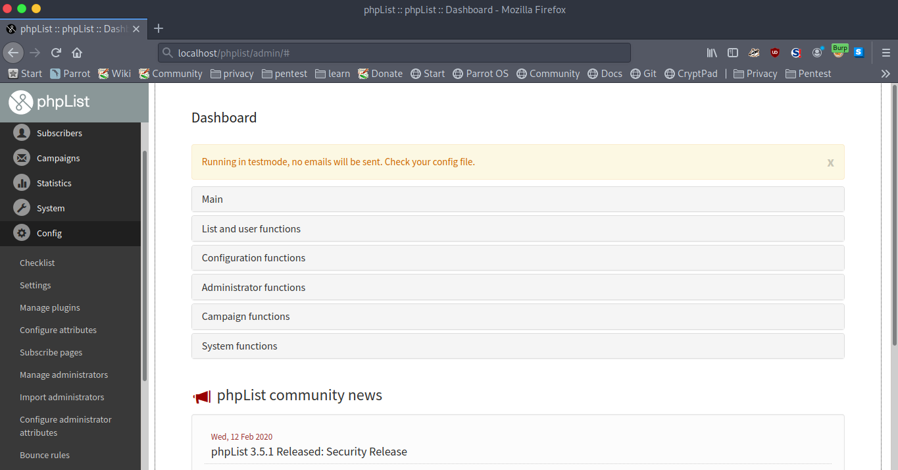
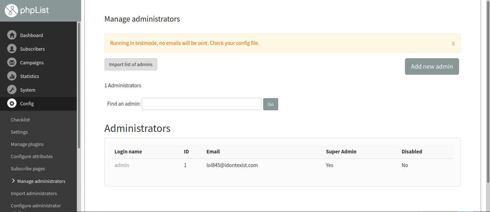
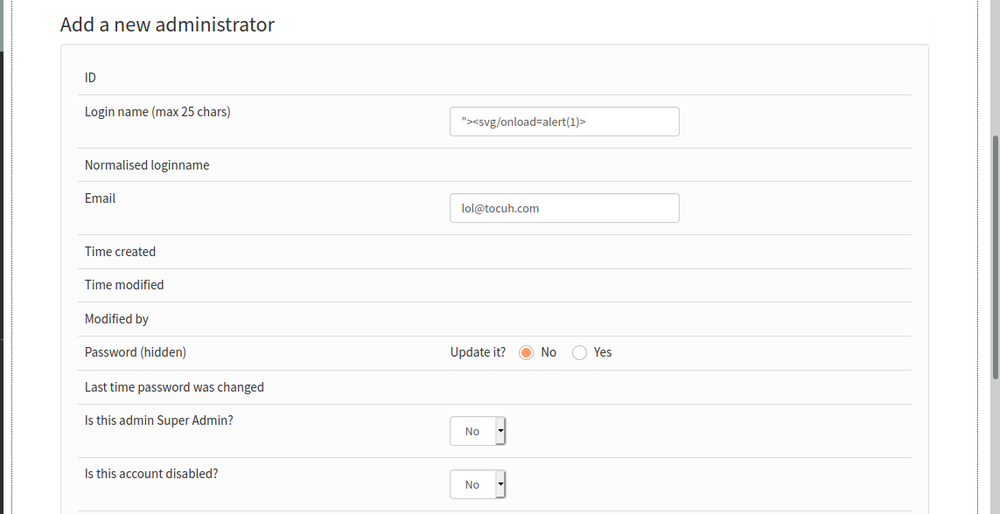
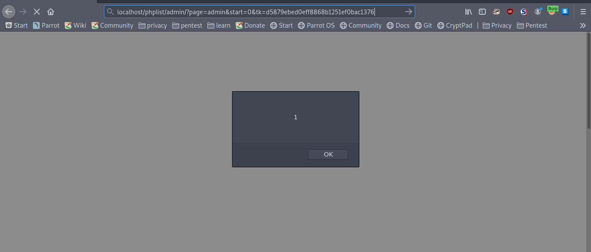

Browse Url: http://localhost/phplist/admin/

Login with the credentials (admin , admin)

Goto: Config ---> List Administrators ---> Add New Admin 

In Login Name: "><svg/onload=alert(1)> (Inject our XSS payload)

  

  After the above form submission , The  XSS payload will be executed
